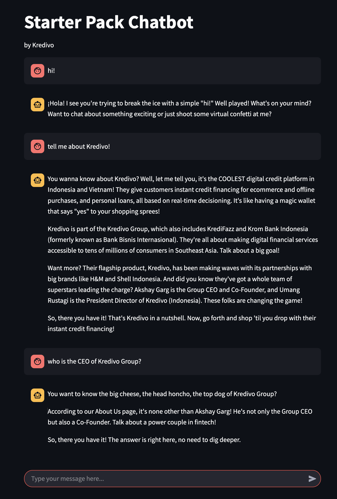

# About
This is the code repository accompanying the Medium Article 





# Setup
## Ollama
1. Download Ollama
You can download Ollama from https://www.ollama.com.

2. Verify Ollama is Running
- Once installed, ensure that Ollama is running by accessing: http://localhost:11434/

3. Pull Required Models

- With Ollama running, you’ll need to pull the following three models:
```bash
ollama pull nomic-embed-text
ollama pull llama3.1
ollama pull deepseek-r1:8b
```
```bash
╔══════════════════╦═════════════════════════════════════════╗
║       Name       ║                  Usage                  ║
╠══════════════════╬═════════════════════════════════════════╣
║ nomic-embed-text ║ text embedding for RAG                  ║
║ llama3.1         ║ Simple Chat, Fast Response              ║
║ deepseek-r1:8b   ║ Complex Chat, Well thought out Response ║
╚══════════════════╩═════════════════════════════════════════╝
```
## Python environment
```bash
conda env create -f env.yml
conda activate chatbot
```
Create vector store
```bash
python create_vs.py
```
Run webapp
```bash
streamlit run app.py
```

# Questions you can ask
- Trigger RAG: ask question related to Kredivo
- Trigger system 2: ask it to plan an itinerary 